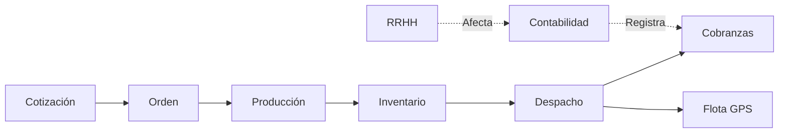

# 🛡️ ERP SERGENSAF: Mega Guía de Mando Maestro (v7.0)
**"Manual de Operaciones de Alto Nivel para la Demo Ejecutiva"**

## ⚠️ NOTA IMPORTANTE: ESTO ES UNA DEMOSTRACIÓN
Esta plataforma es un entorno de simulación avanzado (**Sandbox**). Los datos que verá son representativos de la operación real (Agregados, Flota, Finanzas) pero están aislados para que sus pruebas no afecten a otros usuarios.

---

## 🚀 1. ACCESO MAESTRO "ONE-CLICK"
Para garantizar una experiencia fluida, el sistema cuenta con **5 Estaciones de Mando** independientes.
1.  **URL**: [https://demo-dtg1.vercel.app/login](https://demo-dtg1.vercel.app/login)
2.  **Login**: Haga clic en cualquiera de los botones negros (**Test 1 a Test 5**).
3.  **Bypass**: No requiere contraseña ni confirmación de email. Acceso administrativo total al instante.

---

## 📊 2. CENTRO DE COMANDO (DASHBOARD)
Es la "Torre de Control". Los indicadores se alimentan de lo que sucede en los otros módulos.

### 📈 Indicadores Clave (KPIs):
- **Ventas Mensuales**: Facturación acumulada (Proviene de *Cobranzas*).
- **Órdenes Activas**: Pedidos en cola de producción (Proviene de *Órdenes*).
- **Despacho m³**: Volumen total entregado hoy (Proviene de *Despachos*).
- **Cuentas por Cobrar**: Saldo pendiente de clientes (Proviene de *Cobranzas*).
- **Utilidad Est.**: Margen de ganancia calculado al 35% del bruto.
- **Eficiencia de Planta**: Capacidad productiva actual (Proviene de *Producción*).

### 📉 Gráficos Dinámicos:
- **Histórico Operativo**: Rendimiento de ventas por mes.
- **Mix de Stock**: Gráfico de dona con el porcentaje de materiales (Arena, Piedra, Hormigón).
- **Tendencia 7D**: Comportamiento de la operación en la última semana.

---

## 🛠️ 3. DESGLOSE ATÓMICO POR MÓDULO

### 1. 📋 COTIZACIONES (Ventas)
*Donde inicia el flujo comercial.*
- **Botón `+ Nueva Cotización`**: Abre el formulario de preventa con cálculo de IGV automático.
- **Icono `👁️ Ver`**: Previsualiza los detalles del cliente y materiales seleccionados.
- **Icono `📄 PDF`**: **Botón Crítico.** Genera la propuesta formal en formato profesional listo para el cliente.
- **Estado `Pendiente` -> `Aprobada`**: Al cambiar a "Aprobada", el sistema genera automáticamente una **Orden de Trabajo**.

### 2. 🛒 ÓRDENES (Producción/Logística)
*El puente entre la venta y la operación.*
- **Lista de Órdenes**: Muestra los pedidos confirmados que esperan ser producidos o despachados.
- **Integración**: Una Orden aprobada habilita automáticamente la carga de material en el módulo de *Despachos*.

### 3. 🏗️ PRODUCCIÓN (Planta de Agregados)
*Visualización del proceso industrial.*
- **Stepper Animado**: Verá el progreso visual de cada lote: 
  1. `Extracción` -> 2. `Lavado` -> 3. `Clasificación` -> 4. `Acopio`.
- **Botón `Finalizar Lote`**: Al terminar, el sistema **incrementa automáticamente el stock** en el módulo de *Inventario*.

### 4. 🚛 DESPACHOS (Logística)
*El corazón del movimiento de materiales.*
- **Botón `📡 Radar GPS`**: Abre un monitor giroscópico para rastrear unidades en ruta.
- **Botón `Hoja de Ruta`**: Genera la Guía de Remisión Electrónica detallando m³, placa y chofer.
- **Estado `En Ruta` -> `Entregado`**: Actualiza el inventario y genera la deuda en *Cobranzas*.

### 5. 🛰️ FLOTA & GPS (Monitoreo)
*Control de activos y activos en movimiento.*
- **Mapa en Vivo**: Visualización en tiempo real de toda la flota de camiones.
- **Telemetría**: Verá velocidad (KM/H) y estado del motor.
- **Mantenimiento**: Icono de `Herramienta` para ver cuándo le toca cambio de aceite o revisión técnica a cada unidad.

### 6. 📦 INVENTARIO (Almacenes)
*Control de m³ y materiales.*
- **Kárdex Interactiva**: Icono de `Reloj`. Muestra cada entrada y salida de material con fecha y hora.
- **Alertas de Stock**: 
  - 🟢 **OK**: Stock suficiente. 
  - 🟡 **Bajo**: Requiere alerta de producción. 
  - 🔴 **Agotado**: Detiene ventas automáticamente.
- **Botón `Manual Supply`**: Permite ingresos manuales de material para corregir discrepancias.

### 7. 💰 COBRANZAS (Finanzas)
*El retorno de la inversión.*
- **Timeline de Pagos**: Visualización tipo línea de tiempo de cuándo se emitió la factura y cuándo se abonó.
- **Botón `Registrar Pago`**: Abre el formulario para saldar deudas de clientes.
- **Sello `CANCELADO`**: Se activa visualmente cuando la deuda llega a S/ 0.

### 8. 👥 RRHH (Gestión de Personal)
*El equipo humano tras la operación.*
- **Gestión de Personal**: Lista de empleados con sus seguros, AFP y cargos.
- **Botón `Marcación Manual`**: Permite registrar ingresos/salidas directas (biométrico).
- **Botón `Generar Planilla`**: Procesa sueldos, aportes y genera un **PDF de Boleta de Pago masiva**.

### 9. 🧾 CONTABILIDAD (Libros y Tributación)
*Cumplimiento legal y financiero.*
- **Escanear Factura (IA)**: **Botón "WOW".** Use la cámara para escanear una factura física; la IA detectará RUC, Proveedor e Importe automáticamente.
- **SUNAT SIRE**: Botón para exportar el registro de ventas directamente al formato TXT exigido por SUNAT.
- **Botón `Libro de Ventas/PDF`**: Genera el reporte oficial para el contador.

---

## 🔄 4. EL ECOSISTEMA: FLUJO DE DATOS INTEGRADO
*Cómo se conectan los módulos:*

---

## 🎨 5. GUÍA VISUAL RÁPIDA

### Colores de Estado:
- 🟢 **Verde**: Operación exitosa o factura pagada.
- 🔵 **Azul**: En proceso (Producción activa o Camión en ruta).
- 🟡 **Naranja**: Atención requerida (Bajo stock o pendiente de firma).
- 🔴 **Rojo**: Crítico (Agotado, Deuda vencida o camión en taller).

### Iconos Estrella:
- 📡 `Radar`: GPS en tiempo real.
- 🖨️ `Impresora/PDF`: Generar documentos oficiales.
- 🕒 `Historial`: Kárdex / Movimientos pasados.
- ⚙️ `Engranaje`: Configuración de sistema.

---
**Desarrollado con Excelencia por Antigravity para la Dirección de SERGENSAF.**
